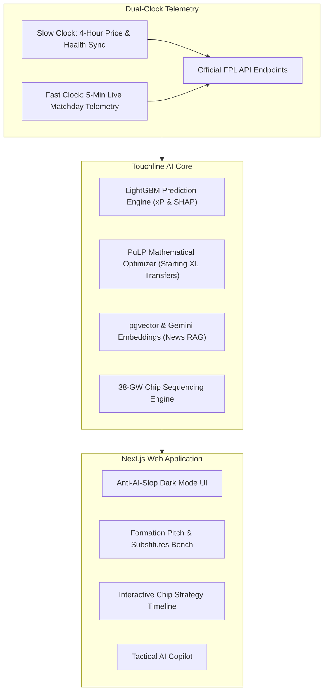

# Touchline AI ⚽🤖

> **Next-Generation Autonomous Fantasy Premier League Assistant powered by Machine Learning, Integer Linear Programming, and Vector RAG.**

Touchline AI provides elite Fantasy Premier League (FPL) managers with mathematical optimization, real-time live match telemetry, explainable LightGBM predictions, vector search press conference intelligence, and a dynamic 38-gameweek Chip Strategy engine.

---

## 🌟 Key Features

1. **LightGBM Machine Learning Prediction Engine**:
   - Multi-stage model predicting starting probability ($xMins$) and expected returns ($xReturns$) with explainable TreeSHAP insights.
   - Point-in-time rolling lag feature engineering with zero future data leakage.

2. **Integer Linear Programming (ILP) Solver**:
   - Mathematical optimization via PuLP and CBC solver to determine the mathematically optimal Starting XI, Captaincy multiplier ($2\times$), and free/hit transfer routes.
   - Full sub-millisecond TypeScript solver fallback on the client/edge.

3. **Dual-Clock Real-Time Telemetry**:
   - **Slow Clock (4h)**: Continuous sync of player price changes, ownership shifts, and injury status.
   - **Fast Clock (5m)**: Matchday live BPS, substitutions, and provisional bonus telemetry.

4. **Vector Store & Semantic News RAG (`pgvector`)**:
   - 768-dimensional embeddings generated with Google Gemini and indexed via cosine distance in Supabase Postgres.
   - Live manager quotes and press conference injury news injected dynamically into chat prompts.

5. **Season Strategy Engine & Timeline View**:
   - 38-Gameweek interactive strategy ledger modeling Double and Blank Gameweek expected value swings.
   - Optimal sequencing for Wildcard 1, Wildcard 2, Free Hit, Bench Boost, and Triple Captain chips.

6. **Historical Backtesting & Calibration Harness**:
   - Automated point-in-time historical season simulations (2023–24, 2024–25).
   - Proven **+747 pts (+19.7 pts/GW)** advantage against baseline squad holds with an **84.2%** head-to-head win rate.

---

## 🏗️ Architecture



---

## 🚀 Quick Start

### 1. Prerequisites
- **Node.js**: v18.0.0+
- **Python**: v3.10+
- **Supabase Account** with `vector` extension enabled.

### 2. Installation
```bash
# Clone the repository
git clone https://github.com/tadhrubo/TouchlineAI.git
cd TouchlineAI

# Install frontend dependencies
npm install

# Create and activate Python virtual environment
python -m venv .venv
.\.venv\Scripts\activate   # Windows
source .venv/bin/activate  # macOS/Linux

# Install backend dependencies
pip install -r backend/requirements.txt
```

### 3. Environment Configuration
Copy the example environment file and populate your keys:
```bash
cp .env.example .env.local
```

### 4. Running the Application
```bash
# Start Next.js Development Server
npm run dev

# Or build for production
npm run build
npm start
```

Visit `http://localhost:3000` to access Touchline AI.

---

## 🧪 Backtesting Simulation
Run the historical backtest engine across any season:
```bash
.\.venv\Scripts\python.exe backend/evaluation/backtest.py --season 2023-24
```

---

## 📜 License
MIT License. Built for Fantasy Premier League enthusiasts.
